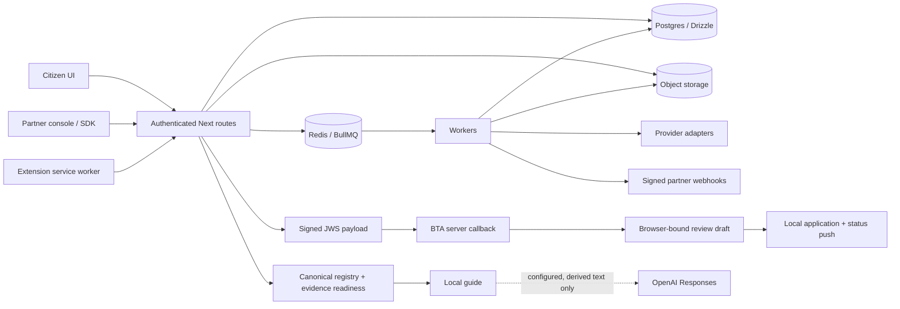

# ApplyOnce: current project context

Updated: 6 September 2026. This document describes the implementation after the audit. Earlier PRDs and plans describe intent and history, and may contain unimplemented production claims.

## Product and problem

ApplyOnce reduces repeated entry of identity, education, family, address and application information. A citizen maintains a reusable vault. Each fact records its source. A partner requests a purpose-bound subset; the citizen reviews it, confirms with OTP or a passkey, and receives a consent receipt. The institution receives a signed payload. A tracker and signed webhook events connect later application status changes and revocation.

The repository is the successor to ApplyOnce. It is a functional sandbox, not a live government identity service or a certified consent manager. The BTA examination and other seeded institutions are examples.

## Runtime map

| Surface | Location | Role |
|---|---|---|
| Public site | `/`, `/demo`, `/for-institutions`, `/privacy`, `/security`, `/terms`, `/dpo`, `/status` | Introduction, sample accounts, operating notice, rights request and health |
| Onboarding | `/auth/login`, `/welcome` | Phone login, name/language, optional provider connection and passkey |
| Citizen | `/app` | Evidence vault, readiness, applications, documents, family and controls |
| Share | `/share/:token` | Exact field review, optional choices, missing answers, confirmation and receipt |
| Partner | `/partner` | Organization switcher, forms, applicants, API keys, webhooks, team and settings |
| Operations | `/admin` | Partner approval, provider jobs, queues, flags, audit and data requests |
| BTA portal | Separate Next app, default `:3301` | Manual exam form and integrated ApplyOnce workflow |
| Extension | `apps/extension` | MV3 service worker, local portal recipes, consent UI and autofill |
| Workers | `apps/worker` | Provider jobs, uploads, webhooks, notifications, expiry/deadline scans and data requests |

Citizen pages include `/app/vault` and each schema section, `/app/apply` and each form slug, `/app/applications` and details, `/app/documents` and details, `/app/verify`, `/app/sign`, `/app/connections` and receipts, `/app/family`, claim/accept links, settings, notification preferences and extension connection instructions. Mobile navigation exposes the full set of core pages.

## Architecture

Next.js 16 / React 19 render the applications. HeroUI 3 and Tailwind 4 supply the existing visual language. Postgres holds accounts, profiles, facts, documents, relationships, consent and application records. Redis supports BullMQ. MinIO supplies local S3-compatible object storage. The SDK uses `jose` for signed payload verification; the crypto package implements authenticated encryption and webhook signatures.

## Shared packages and invariants

- `packages/schema`: canonical fact registry, English/Hindi labels, Zod validation, purpose filters, document-type rules and deterministic readiness.
- `packages/db`: schema and migrations; `putFact` is the write path for values/provenance/history; `listAccessibleProfiles` resolves self, claimed and delegated profiles.
- `packages/crypto`: per-user data encryption keys, environment-backed wrapping key, ES256 payloads and HMAC webhooks.
- `packages/providers`: mock adapters and partial Setu integrations. The interface boundary allows live adapters after credentials and onboarding.
- `packages/sdk`: server session creation, exchange and verification; browser enhancer source is available to bundled clients. The documented basic button uses a native server POST, not an unavailable CDN script.
- `packages/ui`: source labels, fact rows/editors, diff display, forms and tables.

Facts retain `source`, verification metadata, optional expiry, repeat index and evidence reference. Verified values are not silently overwritten by self-entered disagreement. Required expired or conflicting evidence prevents a share. Referenced documents must belong to the selected profile and match the expected document type. A database trigger enforces the consent prerequisite for shares.

## End-to-end application path

1. Open a form in Apply. A read-only request calculates evidence readiness; visiting or prefetching the page does not create a share session.
2. Continue to the BTA session endpoint, or create a ApplyOnce-hosted sandbox session for the other catalog institutions.
3. The share screen shows partner, purpose, retention, required facts, optional facts and form-specific questions.
4. Fill missing values and choose appropriate documents. Confirm with a fresh OTP/passkey.
5. A transaction claims the open session and writes consent, application, signed share, event, audit and queued webhook rows.
6. BTA validates the callback state cookie, exchanges the short-lived token with the shared SDK and saves a browser-bound draft.
7. The review page can refresh without reusing the single-use token. Edited fields remain edited when the view mode changes.
8. Submission uses identifiers and document references from the server draft. BTA creates a local application and sends `under_review` to ApplyOnce.
9. Sandbox status controls require the application access cookie and an explicit production-build flag. ApplyOnce receives status events; revocation blocks further access and notifies BTA.

## New differentiator: evidence readiness

Readiness asks whether required answers are present and usable. It checks purpose, profile scope, source, expiry and unresolved mismatch. It does not infer eligibility, admission probability or legal validity. Boolean false can be a complete answer; a required declaration must be affirmatively confirmed.

The page shows a percentage, ordered gaps, direct repair links, source detail and approaching expiry. Ask ApplyOnce explains next steps, sharing or provenance. Without external credentials it uses deterministic English/Hindi guidance. Optional model output is explanatory only and cannot mutate facts, change the score or submit applications.

## Family and access

Owned dependent records no longer bypass their relationship scope. Expired access falls out of the active profile list. Adult scope/expiry changes cannot unilaterally increase the guardian's permissions. Document listing, reading, uploads, references and extension downloads apply the same scope principles.

A claimed profile still uses the original owner's encryption key in the inherited model. Erasure now places such an account on hold instead of cascading deletion into another adult's claimed profile. A production key-transfer migration is still required. Exports resolve current accessible profiles and apply their scopes.

## Documents and declaration receipts

Uploads share a 15 MB PDF/JPEG/PNG/WebP contract between client, API and worker. Processing validates size, recognizable content header and hash. Extraction remains a proposal requiring review. It is not antivirus scanning and mock OCR is not document understanding.

Seeded evidence has deterministic viewable sample attachments. Sample photograph and signature placeholders have the correct document types and are visibly synthetic. Preview URLs have a five-minute, document-bound ticket and re-check the session and profile access.

`/app/sign` creates a full-text declaration receipt after confirmation, stores it in object storage and lists it in Documents. It includes confirmation time and a SHA-256 digest. It is explicitly a sandbox alternative to the previously disabled e-Sign feature, not a licensed digital signature.

## Operational behavior

Root commands load `.env`; explicit shell exports win. Build/start commands use production mode, while mock providers remain an independent configuration choice. The worker publishes a short-lived Redis heartbeat, and the status page checks that instead of equating reachable queues with a running worker.

BTA's demo persistence is a synchronous JSON store with atomic file replacement. It is appropriate for one demo process with a persistent directory, not horizontal scaling. State nonces and review drafts expire. External provider calls no longer silently become offline fixtures: `DEMO_OFFLINE=1` is an explicit alternative mode.

## What requires external work

Live identity/financial/health verification, production SMS/email, licensed e-Sign, real OCR, managed KMS, encrypted object storage, malware scanning, data lifecycle cleanup and operational/legal review remain deployment requirements. OpenAI explanation requests were tested with stubbed responses and failure cases; no paid live-model request was made without credentials. See `INTEGRATIONS-AND-ROADMAP.md` and `AUDIT-REPORT.md` for the evidence and limits.
